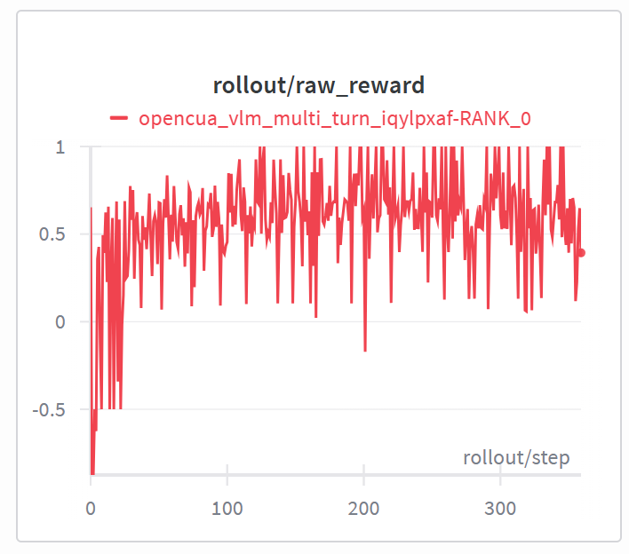

# VLM Multi-Turn (FSDP backend, opencua dataset)
Training VLM with FSDP on [opencua click dataset](https://huggingface.co/datasets/mlfoundations-cua-dev/agentnet-clicks) with multi-turn reasoning with interactive environment feedback, using GRPO. .

## data prepocessing


## rollout
The multi-turn rollout is implemented through a custom generate function  `examples.opencua_vlm_multi_turn.rollout.generate`, overriding the original generate function.

In terms of the environment interaction, this example initializes a custom interactive environment in `examples/opencua_vlm_multi_turn/env_opencua.py` with the APIs below.
<details>
<summary>Environment API (opencua)</summary>

- `build_env(sample: Sample | None = None, args: Any | None = None, **_) -> Geo3kEnv`: constructs the env.
- `reset() -> tuple[dict, dict]`: clears internal state.
- `step(response_text: str) -> tuple[dict, bool, dict]`: Parses the actor’s response text and updates the environment state. Returns a new observation. Similar to on-screen click feedback, if the model’s predicted location is inaccurate, the feedback should indicate the direction and distance relative to the true bounding box.
- `format_observation(observation: dict) -> dict`: converts an env observation into a chat message.
</details><br>

## Reward
The reward model is the OpenCUA Click RM in `slime/rollout/rm_hub/opencua_click.py`. It evaluates a predicted (x, y) location against a ground-truth bounding box and provides a reward based on accuracy and validity:

- Hard constraint: If the predicted coordinates are outside the [0, 1] range, a penalty of -0.5 is returned.

- Inside bounding box: If the prediction lies within the ground-truth box, the reward is 1.0.

- Soft distance penalty: For predictions outside the box but still within [0, 1], a smooth L-infinity distance (d_soft) to the box is computed, and the reward decays exponentially with distance: exp(-5.0 * d_soft).


The `compute_opencua_reward` function parses the model’s output text to extract coordinates in the \boxed{(x, y)} format. If parsing fails or the solution is invalid, negative rewards are returned (-1.0). Otherwise, it computes the reward using the `grounding_reward` function. 



## Reproduce
```bash
# 1) Set environment variable
export WANDB_API_KEY=...
export SLIME_SCRIPT_MODEL_NAME=Qwen3-VL-2B-Instruct
export SLIME_SCRIPT_NUM_GPUS=4
export SLIME_SCRIPT_TRAIN_BACKEND=fsdp

# 2) Download the dataset
hf download mlfoundations-cua-dev/agentnet-clicks --repo-type=dataset --local-dir /root/datasets/opencua

python examples/opencua_vlm_multi_turn/data_prepocessing.py
# 3) Run the script:
cd /root/slime
python examples/opencua_vlm_multi_turn/run_opencua_vlm_multi_turn.py
```

## What each file does
- `examples/opencua_vlm_multi_turn/data_prepocessing.py`: adapts the data format so that it can be correctly recognized and processed by slime.
- `examples/opencua_vlm_multi_turn/run_opencua_vlm_multi_turn.py`: downloads model, sets training/rollout args, and launches the run.
- `examples/opencua_vlm_multi_turn/opencua_vlm_multi_turn_config.yaml`: specifies `max_turns` and `rollout_interaction_env_path` for the multi-turn rollout.
- `examples/opencua_vlm_multi_turn/rollout.py`: custom multi-turn rollout that calls SGLang for token generation, builds loss masks/log_probs, enforces max_turns, and early-stops on max_new_tokens.
- `examples/opencua_vlm_multi_turn/env_opencua.py`: opencua click env that parses `\boxed{(x, y)}`, scores position answers, and returns env feedback per turn.
- `slime/rollout/rm_hub/opencua_click.py`:computes rewards based on the opencua click environment.